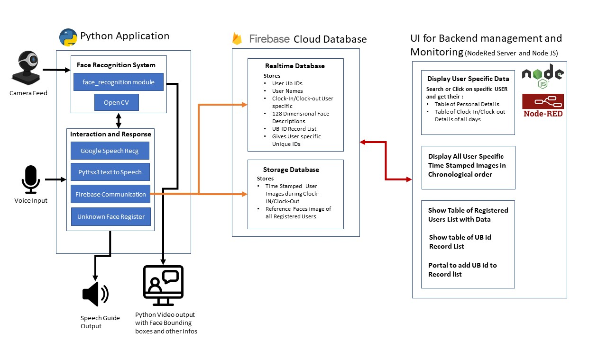
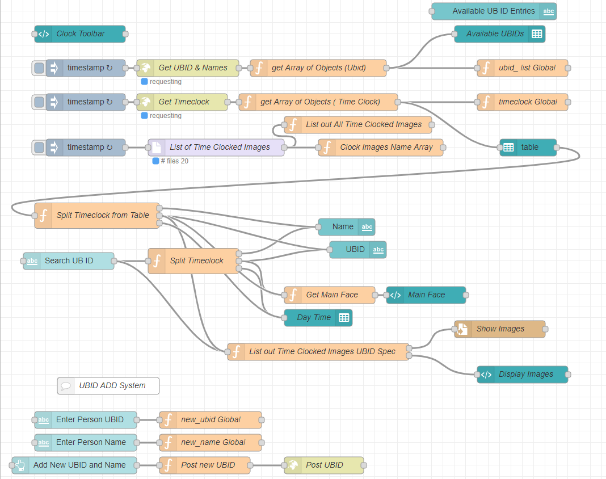

# touchlessClockin_project
This is a computer vision based project developed admist the pandemic situation where touchless systems are required everywhere. It uses face recognition and deep learning to identify employees/members of an institution to check in or check out of the system without touching, It uses voice interaction and has a sophisticated interface done with opencv. It is also integrated with google's firebase which is a cloud managed structureless database which stores all the user data, time stamped images for security and face descriptions. A UI for the administrator is also developed using NodeRed platform which can be used to monitor the user checkin activities. 

# Instructions

# The Touchless Clock In system 
Make sure you have installed the necessary python packages from "requirements.txt"
To run the main Touchless Clock In system python program : Execute "python Touchless_clockin.py"

# Access Admin Backend UI

Make sure you have installed Node-Red for windows : Tutorial can be found "https://nodered.org/docs/getting-started/windows"

Make sure you have installed the necessary NPM packages for the node-red using the following commands 
```
npm i node-red-contrib-fs
npm i node-red-dashboard
npm i node-red-node-ui-table
```

To start the Node Red server and open the UI in a browser : Double click "start_nodered_UI.batch"

To access the flow based programer of the Node Red : go to "http://localhost:1880/" when the node-red server is running
